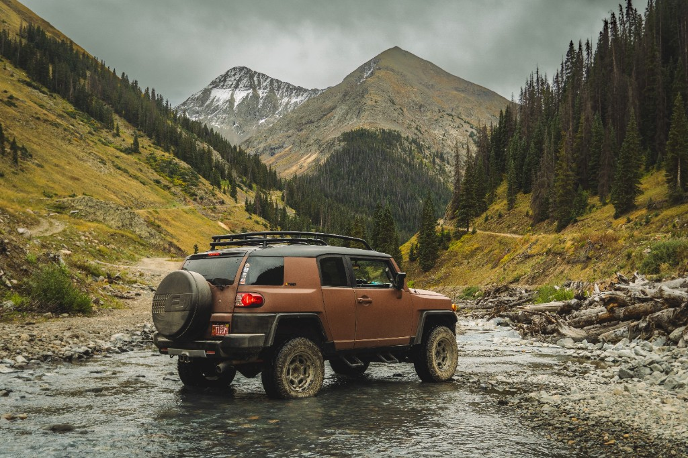

# FRAME — AI Shot List Generator

A photography tool that uses AI to generate detailed, professional shot lists from a simple shoot brief. Built with Python, Streamlit, and the OpenAI API.



---

## What It Does

You fill in the details of your shoot — concept, location, mood, duration — and the AI generates:

- A numbered shot list with composition, angle, and lighting notes
- Hero shots (the must-capture frames)
- Gear and lens recommendations
- A structured session timeline
- Director's notes and pro tips

Results can be downloaded as a formatted PDF.

---

## Tech Stack

| Layer | Tool |
|---|---|
| UI | Streamlit |
| AI / LLM | OpenAI GPT-4o mini |
| PDF Generation | fpdf2 |
| Environment Config | python-dotenv |
| Language | Python 3.13 |

---

## How to Run Locally

**1. Clone the repo**
```bash
git clone https://github.com/YOUR_USERNAME/frame-shot-list-generator.git
cd frame-shot-list-generator
```

**2. Create a virtual environment and install dependencies**
```bash
python3 -m venv .venv
source .venv/bin/activate
pip install -r requirements.txt
```

**3. Add your API key**

Create a `.env` file in the project root:
```
OPENAI_API_KEY=your-openai-api-key-here
```

**4. Run the app**
```bash
streamlit run app.py
```

Open `http://localhost:8501` in your browser.

---

## Project Structure

```
frame-shot-list-generator/
├── app.py              # Main application — UI, AI call, PDF generation
├── requirements.txt    # Python dependencies
├── .env                # API keys (not committed — see .gitignore)
├── .gitignore
├── assets/
│   └── hero.png        # Hero banner photo
└── .streamlit/
    └── config.toml     # Streamlit config (disables usage stats prompt)
```

---

## Key Implementation Notes

**Structured AI Output** — The OpenAI call uses a carefully designed system prompt that enforces specific output sections (Shot List, Hero Shots, Gear, Session Flow, Director's Notes). This consistency is what makes the output reliably parseable for PDF generation — if the structure varies, the PDF breaks. Getting this right took iteration.

**PDF Generation** — Built with `fpdf2`. The AI returns markdown, so before rendering to PDF, a regex pass strips markdown syntax (`**bold**`, `## headings`) and maps section headers to styled PDF elements — larger font, amber color, a rule underneath. The output mirrors the app's visual identity.

**Credentials & Security** — API keys live in a `.env` file loaded via `python-dotenv`, never hardcoded. `.gitignore` excludes `.env` and `.venv/` from version control from day one.

**Hero Image as CSS Background** — The banner photo is `base64`-encoded at runtime in Python and injected as a CSS `background-image` data URI. This avoids needing Streamlit's static file server and works cleanly in any environment.

**UX Design Decisions** — The dark theme uses layered greys (`#181818` page → `#212121` cards → `#2a2a2a` inputs) rather than pure black, following WCAG contrast guidelines. The amber accent (`#c9a050`) adds warmth appropriate for a photography tool. Typography uses Playfair Display (editorial headings) paired with Inter (readable UI text).

---

## Built By

Raghuveer Metla — photographer and developer.  
Designed and built as a personal tool to solve a real problem in my photography workflow.
The product idea, UX design, feature decisions, and technical implementation are all my own.
# photography-shot-list-generator
